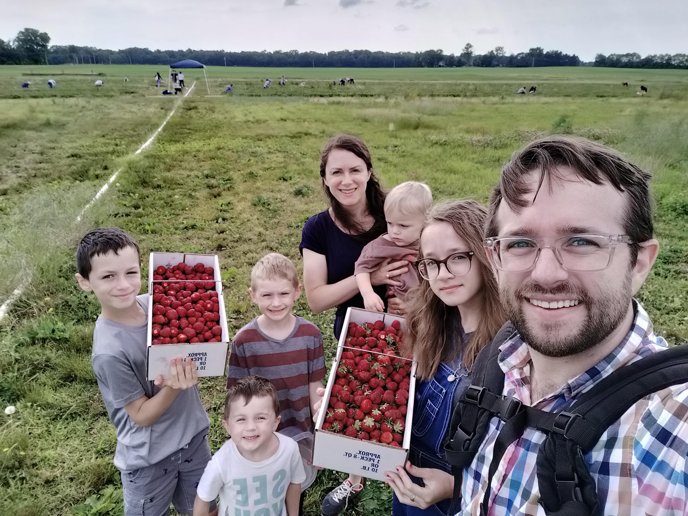

```{r setup, include=FALSE}
knitr::opts_chunk$set(echo = FALSE)
knitr::opts_knit$set(root.dir = './')

f <- function (x) {formatC(x, format="d", big.mark=',')}
bold <- function(x) {paste('{\\textbf{',x,'}}', sep ='')}
gray <- function(x) {paste('{\\textcolor{gray}{',x,'}}', sep ='')}
wrapify <- function (x) {paste("{", x, "}", sep="")}
p <- function (x) {formatC(x, format='f', digits=1, big.mark=',')}
```

# Welcome to COM 674!

## About Me



## Introductions

## Dad Joke

- Why did the nearsighted man fall in the well?

> - He couldn't see that well!

# The Class


## Programming provides exciting opportunities for social scientists

> - Digital data is exploding and programming is required to do research at scale
> - Algorithms mediate more and more interactions and understanding programming can help us to analyze them
> - Computational methods let us do new things
>	- NLP
>	- Simulation
>	- Large-scale experiments
> - There is value in "thinking like a computer"

## Goals

> - Learn basic programming
> - Be able to collect and visualize data from the web
> - Present computational research
> - Read and evaluate computational social science research

## This is an intense class intended to teach the basics of skills used by computational social scientists

> - But we can do it!
> - Module 1: Python for Everybody
> - Module 2: Pandas, visualizations, and APIs
> - Module 3: Data cleaning, version control, etc.
> - Module 4: Work on final project

## Day-to-day

> - Example paper
>	- One person will present each day + lead discussion
>	- Others will be prepared to discuss
> - Lecture
>	- Recorded lecture on coding topic
>	- Notebook to follow along - download and run each day
>	- Class time focused on confusions + Coding Challenges
> - Coding Challenges
>	- Random "cold calling" for reviewing solutions
> - Co-working


## Coding Challenges

> - Exercises from the book
> - Jupyter Notebooks
> - Suggested approach:
>	- Work with a partner
>	- Ask questions on Discord
>	  - Surround code with three backticks (```)
>	- Look up solutions (where available)


## Final Project

> - Default option
>	- Jupyter notebook
>	- Methods + result section of paper
> - Replication?
> - Do what is best for your future goals

## Project Milestones

> - Final project
>	- Identify a dataset and general plan (September 9)
>	- Project planning doc (October 21)
>	- Project presentation + report (December 9 and 15)

## Grades

> - Goal is learning
> - Three self-assessment reflections

# Resources

## Wiki

> - Schedule
> - Links to readings
> - Slides and videos may be from older versions of the class
>	- I will try to stay 2 weeks ahead

## Brightspace

> - Readings
> - Example Projects

## Discord

> - Post questions and help each other
> - I will post annoucements

## Anaconda / Jupyter Intro
