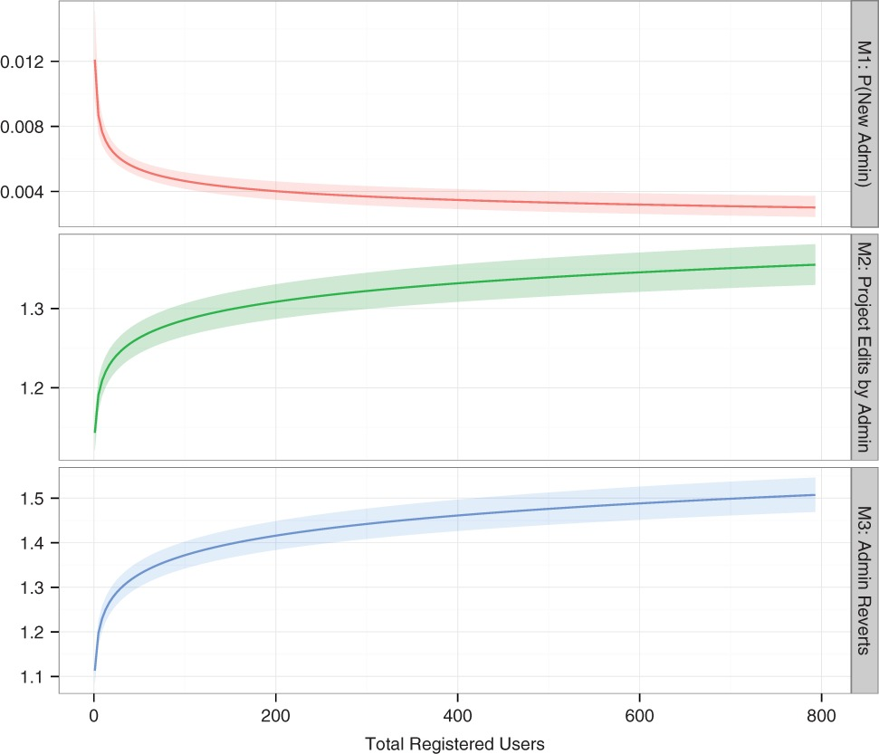

```{r setup, include=FALSE}
knitr::opts_chunk$set(echo = FALSE)
knitr::opts_knit$set(root.dir = './')

f <- function (x) {formatC(x, format="d", big.mark=',')}
bold <- function(x) {paste('{\\textbf{',x,'}}', sep ='')}
gray <- function(x) {paste('{\\textcolor{gray}{',x,'}}', sep ='')}
wrapify <- function (x) {paste("{", x, "}", sep="")}
p <- function (x) {formatC(x, format='f', digits=1, big.mark=',')}
```

## Weekly Dad Joke

I accidentally swallowed a bunch of scrabble tiles.

<span class='fragment'> My next trip to the bathroom could spell disaster.</span>

## Housekeeping

> - Project Planning Doc
> - Self assessment doc
> - APIs coming up this week

## Paper Discussion

Shaw, A., & Hill, B. M. (2014). Laboratories of oligarchy? How the iron law extends to peer production. Journal of Communication.

## The Iron Law of Oligarchy

> - As organizations become more complex, a small group of early members gain and exercise power
> - But this shouldn't be true in online organizations, right?
>	- Almost definitionally democratic
>	- Anyone can contribute at any time
>	- Contributors are volunteers without "real" power
>	- Technology-mediated communication &rarr; flatter organizations

## The study

> - Looking at large wikis over time:
>	- H1: The probability of adding new administrators declines as contributor base grows
>	- H2: Administrators will contribute more to administrative pages as wiki grows
>	- H3: Reverts of experienced contributors' edits will grow as wiki grows

## Results



## Homework Review


